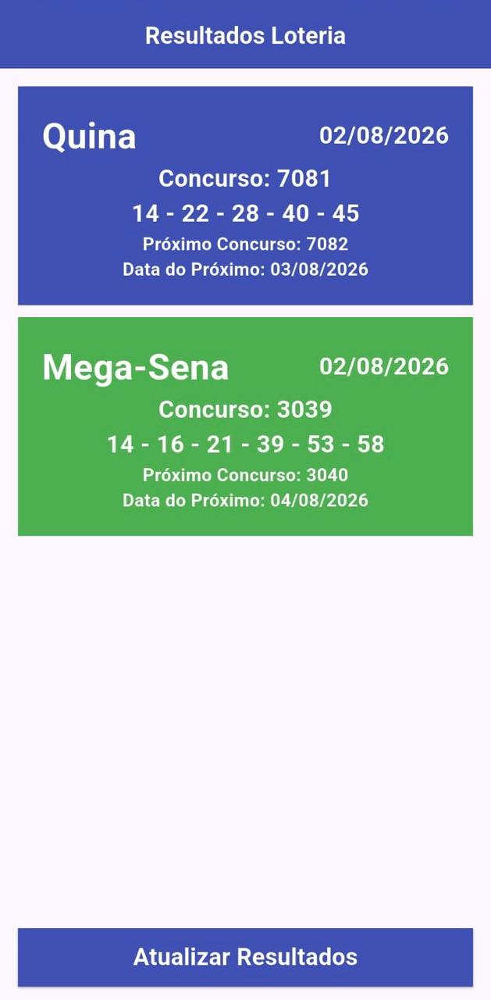
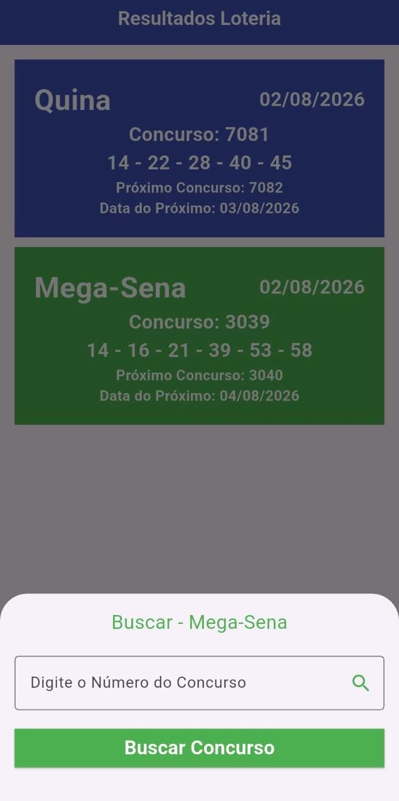

# LotteryApp

O **LotteryApp** é um aplicativo desenvolvido em Flutter para consultar, de forma simples e rápida, os resultados da **Quina** e da **Mega-Sena**.

O projeto surgiu com dois objetivos: ajudar meu pai a acompanhar os resultados das loterias e colocar em prática os conhecimentos de Dart e Flutter adquiridos durante as aulas da faculdade.

## Funcionalidades

- Exibição dos resultados mais recentes da Quina e da Mega-Sena;
- Apresentação das informações em cards;
- Consulta de um concurso específico;
- Consumo dos dados diretamente do Portal de Loterias da Caixa.

Na tela principal, cada modalidade possui um card com as seguintes informações:

- Números sorteados;
- Data do sorteio;
- Número do concurso atual;
- Número do próximo concurso;
- Data do próximo concurso.

Ao tocar no card da Quina ou da Mega-Sena, é possível pesquisar um concurso específico. O resultado da busca é apresentado em outro card, contendo:

- Número do concurso;
- Números sorteados;
- Data do sorteio.

## Tecnologias utilizadas

- [Flutter](https://flutter.dev/)
- [Dart](https://dart.dev/)
- API do Portal de Loterias da Caixa

## Fonte dos dados

As informações são consultadas nos seguintes endpoints públicos do Portal de Loterias da Caixa:

# Resultado do último concurso:

```text
Quina:
https://servicebus2.caixa.gov.br/portaldeloterias/api/quina

Mega-Sena:
https://servicebus2.caixa.gov.br/portaldeloterias/api/megasena
```

Quando o usuário deseja buscar um concurso específico, o aplicativo acrescenta o número informado ao final da URL da modalidade selecionada:

# Resultado do concurso informado pelo usuário:

```text
Quina:
https://servicebus2.caixa.gov.br/portaldeloterias/api/quina/{concurso_especifico}

Mega-Sena:
https://servicebus2.caixa.gov.br/portaldeloterias/api/megasena/{concurso_especifico}
```

## Telas

<p align="center">
  
  &nbsp;&nbsp;
  
</p>

<p align="center">
  <em>Tela inicial com os resultados mais recentes e busca por um concurso específico.</em>
</p>

## Motivação

Além de resolver uma necessidade real da minha família, o LotteryApp foi uma oportunidade de aprender na prática conceitos importantes do desenvolvimento mobile com Flutter, como construção de interfaces, navegação entre telas, consumo de APIs e exibição de dados.

---

> Este projeto não possui vínculo oficial com a Caixa Econômica Federal. Os resultados exibidos são obtidos por meio do Portal de Loterias da Caixa.
